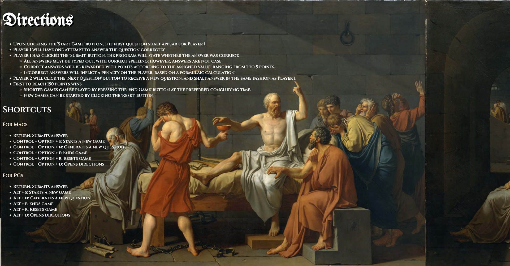
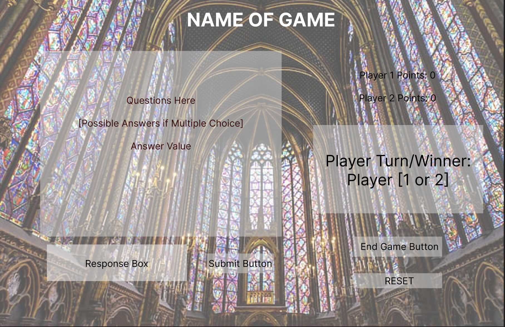

# Beguiling Minutiae

## Overview
This trivia game will test your knowledge of intricate details across a great breadth of subjects. 

## Technologies Utilized
- CSS
- HTML
- JavaScript

## Technical Requirements
- Render a game in a browser.
- Include separate HTML, CSS & JavaScript files with proper indentation and no dead code.
- Manipulate the DOM by means of JavaScript.
- Deploy game via GitHub Pages.

## Instructions
- Upon clicking the 'Start Game' button, the first question shalt appear for Player 1.
- Player 1 will have one attempt to answer the question correctly.
- After Player 1 has clicked the 'Submit' button, the program will state whether the answer was correct.
    - All answers must be typed out, with correct spelling; however, answers are not case sensitive.
    - Correct answers will be rewarded with points according to the assigned value, ranging from 1 to 5 points.
    - Incorrect answers will inflict a penalty on the player, based on a formulaic calculation.
- Player 2 will click the 'Next Question' button to receive a new question, and shalt answer in the same fashion as Player 1.
- First to reach 150 points wins.
    - Shorter games can be played by pressing the 'End Game' button at the preferred concluding time.
    - New games can be started by clicking the 'Reset' button.

## Potential Future Modifications
- Create subject-specific question sets.
- Provide correct answers if inputted answer is incorrect.
- Provide proportional statistics to inform players of percentage of questions answered correctly.
- Generate a leaderboard based on total games won.
- Allow players to enter their names to personalize the game.

## MVP Intentions
- User should have a clearly defined layout, with components appropriately labeled.
- User should easily be able to delineate between purposes of the respective areas (i.e. buttons, input area, question generation, etc.).
- User should be able to utilize keyboard shortcuts, including the return key, to maximize efficiency of gameplay.
- User should be informed whether answer was correct upon submission.
- User should be indicated of victor upon reaching the defined point limit or by clicking the 'End Game' button.

## Wireframe
